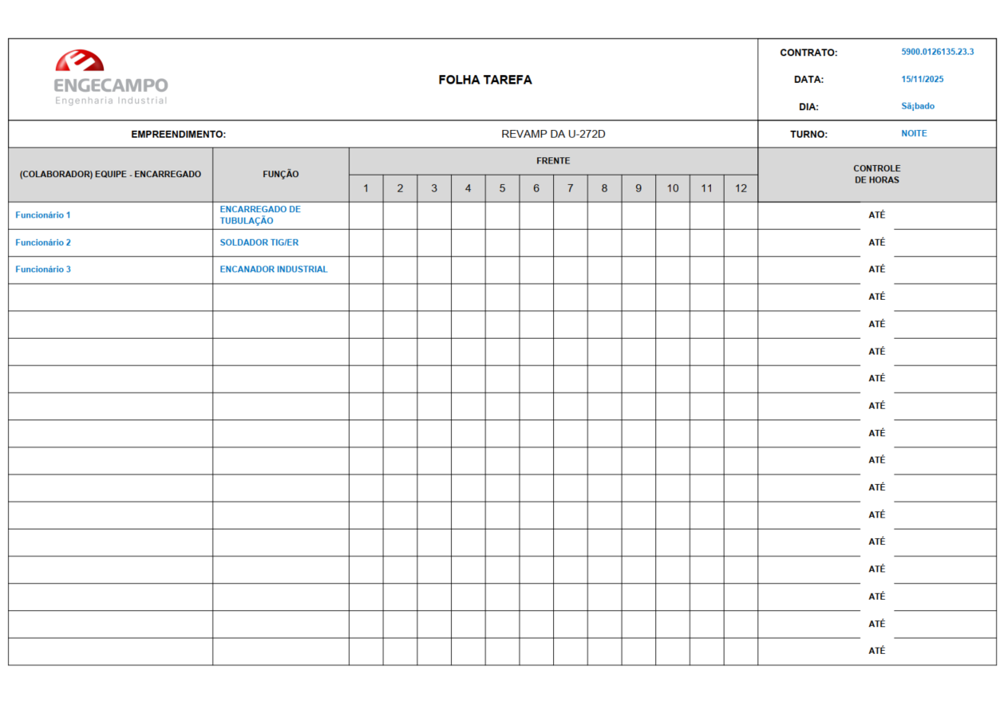
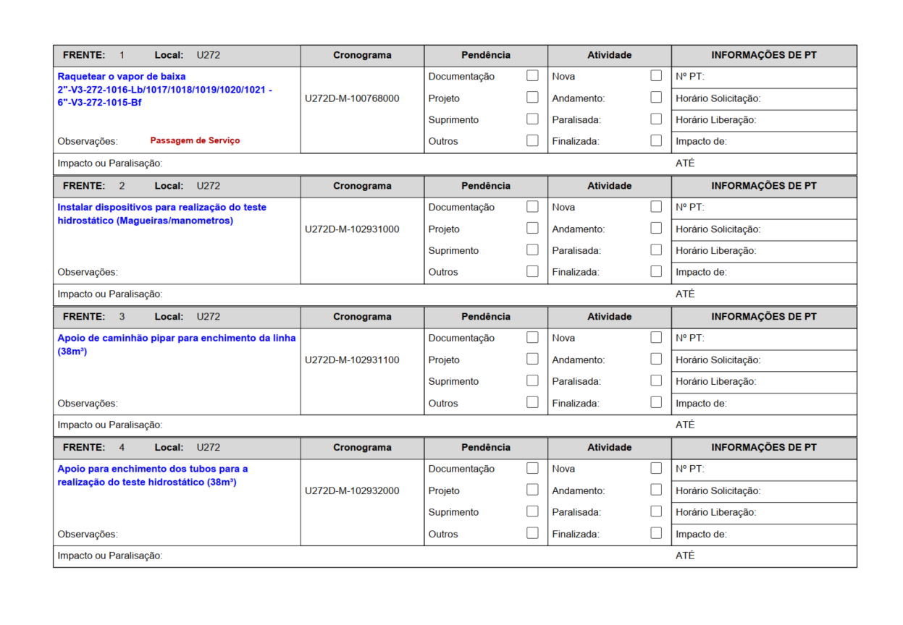

# 🧱 Gerador de Folhas-Tarefa (Monday.com)

## 📌 Objetivo
Este projeto tem como objetivo **automatizar a geração de Folhas-Tarefa (PDFs)** a partir do **cronograma extraído em formato Excel do Monday.com**.  
A ferramenta processa os dados, identifica atividades por **turno** e **responsável**, e cria **arquivos PDF prontos para impressão**, organizados por encarregado.

---

## ⚙️ Como usar

### 1. 📤 Extração do arquivo no Monday
No painel **"[REVAP] CONTROLE DE ATIVIDADES"** do Monday.com:

- Exporte as atividades em formato **Excel (.xlsx)**.
- O arquivo exportado deve conter, **no mínimo**, as seguintes colunas:

| Coluna | Descrição |
|--------|------------|
| `Name` | Nome da atividade |
| `Status` | Situação atual da atividade (`Atraso`, `Em andamento`, `Cronograma`, etc.) |
| `Cronograma - Start` | Data de início da atividade (formato `DD/MM/AAAA`) |
| `Cronograma - End` | Data de término da atividade (formato `DD/MM/AAAA`) |
| `Hora Início` | Horário de início (formato `HH:MM`) |
| `Hora Fim` | Horário de término (formato `HH:MM`) |
| `Encarregado Manhã` | Responsável no turno da manhã |
| `Encarregado Noite` | Responsável no turno da noite |

> 💡 O script inclui uma etapa de pré-processamento para garantir que **todas as datas e horas** estejam formatadas corretamente antes da execução.

---

### 2. ▶️ Execução

#### 1. Certifique-se de que o projeto está estruturado assim:

```
meu_projeto/
├── gerar_folha_tarefa.py
├── equipes.py
├── funções/
│ ├── gerar_capa.py
│ ├── layout.py
│ └── processar_planilha_monday.py
└── imagens/
├── logo.png
└── square.png
```

#### 2. Execute o script principal:
```bash
python gerar_folha_tarefa.py
```

#### 3. Na interface (ou terminal), selecione:

- O arquivo Excel exportado do Monday;

- A data desejada;

- O turno (Manhã ou Noite).

#### 4. Os PDFs serão gerados automaticamente na pasta:

```
Folhas-Tarefa DD-MM-YYYY_TURNO/
```

## 🧠 Lógica aplicada

### O sistema identifica quais atividades devem ser incluídas nas Folhas-Tarefa com base nas seguintes regras:

### Turnos:

- **Manhã:** atividades que se iniciam entre **08:30 e 18:00**;

- **Noite:** atividades que se iniciam entre **19:30 e 05:00** do dia seguinte;

- Caso a tarefa inicie no limite do turno (ex.: 17:30 → 01:00), ela é atribuída ao turno de início (Manhã, neste exemplo).

### Status Prioritário:

- Atividades com Status = **"Atraso"** ou **"Em andamento"** são sempre incluídas, independente da data ou hora.

### Agrupamento:

- As atividades são organizadas por responsável (Encarregado) de acordo com o turno selecionado;

- Cada encarregado recebe um PDF contendo as atividades do seu turno e sua equipe (definida no arquivo equipes.py).

###  Saída:

#### Cada PDF inclui:

- Capa com informações da equipe e data;

- Lista das atividades atribuídas ao encarregado.

## 🧩 Dependências

- reportlab

- openpyxl

- pandas

### Instale-as com:
```
pip install reportlab openpyxl pandas
```

## 🖼️ Exemplo de saída

#### Capa



#### Lista de Atividades 



## 💻 Exemplos input/output

### Considere essas atividades no Excel:

| Name | Status | Cronograma - Start | Cronograma - End | Hora Início | Hora Fim | Encarregado Manhã | Encarregado Noite |
| ---- | ---- | ---- | ---- | ---- | ---- | ---- | ---- | 
| Atividade 1 | Atraso | 05/10/2025 | 06/10/2025 | 20:00 | 01:00 | L | M |
| Atividade 2 | Cronograma | 04/10/2025 | 04/10/2025 | 20:00 | 22:00 | L | M |
| Atividade 3 | Cronograma | 13/11/2025 | 13/11/2025 | 01:00 | 14:00 | L | M | 
| Atividade 4 | Em andamento | 12/11/2025 | 12/11/2025 |14:00 | 15:00 | L | M |
| Atividade 5 | Cronograma | 12/11/2025 | 12/11/2025 |14:00 | 15:00 | L | M |
| Atividade 6 | Parasalisado | 12/11/2025 | 13/11/2025 |21:00 | 01:00 | L | M |

### Exemplo 1

#### Entrada: 
```
12/11/2025 Noite
```
#### Saída: 

> Em todas as atividades o Responável é o "Encarregado Noite"

| Atividade | Entra na lista de atividades? | 
| ---- | ---- | 
| Atividade 1 | ✅ | 
| Atividade 2 | ❌ | 
| Atividade 3 | ✅ |  
| Atividade 4 | ✅ | 
| Atividade 5 | ❌ |
| Atividade 6 | ✅ | 

### Exemplo 2

#### Entrada: 
```
12/11/2025 Manhã
```
#### Saída: 

> Em todas as atividades o Responável é o "Encarregado Manhã"

| Atividade | Entra na lista de atividades? | 
| ---- | ---- | 
| Atividade 1 | ✅ | 
| Atividade 2 | ❌| 
| Atividade 3 | ❌ |  
| Atividade 4 | ✅ | 
| Atividade 5 | ✅ |
| Atividade 6 | ❌ | 

### Exemplo 3

#### Entrada: 
```
20/11/2025 Noite
```
#### Saída: 

> Em todas as atividades o Responável é o "Encarregado Noite"

| Atividade | Entra na lista de atividades? | 
| ---- | ---- | 
| Atividade 1 | ✅ | 
| Atividade 2 | ❌ | 
| Atividade 3 | ❌ |  
| Atividade 4 | ✅ | 
| Atividade 5 | ❌ |
| Atividade 6 | ❌ | 

### Exemplo 4

#### Entrada: 
```
20/11/2025 Manhã
```
#### Saída: 

> Em todas as atividades o Responável é o "Encarregado Manhã"

| Atividade | Entra na lista de atividades? | 
| ---- | ---- | 
| Atividade 1 | ✅ | 
| Atividade 2 | ❌| 
| Atividade 3 | ❌ |  
| Atividade 4 | ✅ | 
| Atividade 5 | ❌ |
| Atividade 6 | ❌ | 

